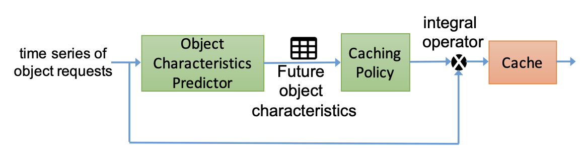
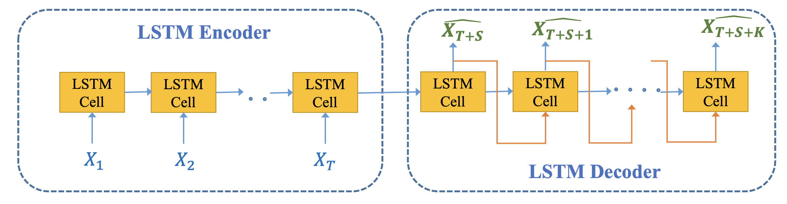
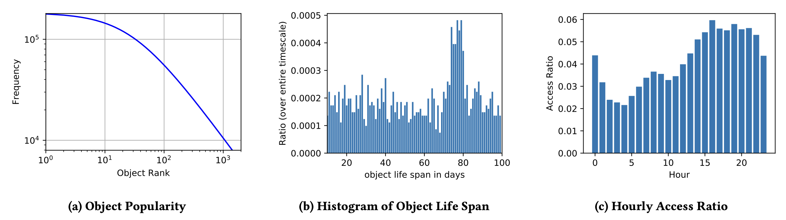
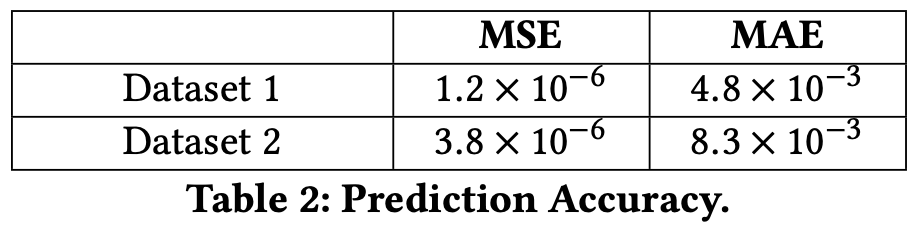
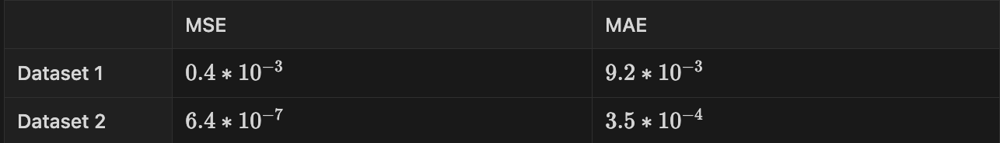
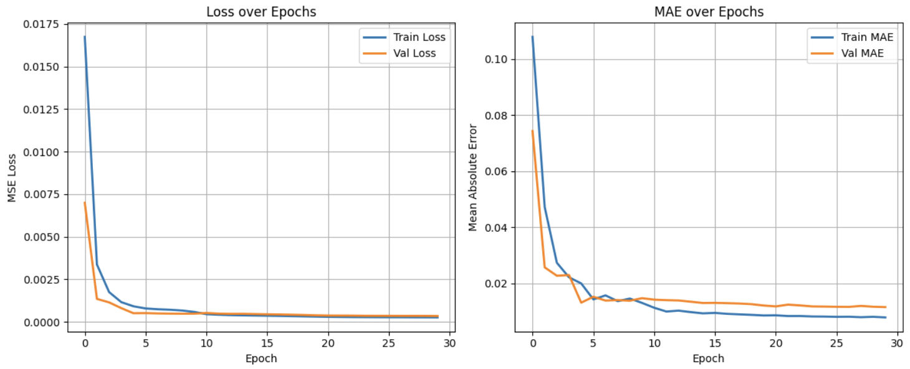

# Deep Cache 

## Related Paper
- Deep Cache: A Deep Learning Based Framework For Content Caching

## Datasets
- Dataset1: [SyntheticDataset](https://www.kaggle.com/datasets/trispark/deep-cache-dataset)
- Dataset2: [MediSynDataset](https://www.kaggle.com/datasets/kjiyunl/deep-cache-dataset2)

## Presentation
- Youtube Link: [Deep Cache](https://www.youtube.com/watch?v=brpeLnH7wxI)

 

# Paper Review
## Abstract

### DeepCache

- Framework for content caching, which can significantly boost cache performance.
- Main Components
    1. Object characteristic predictor → Predict the future characteristics of an object (like object popularity)
    2. Caching policy component → Account for predicted information of objects to make smart caching decisions 

---

## Introduction

### Backgound

- Rapid increase in video streaming service → Information centric networks (ICN) emerged
    - ICN
        - Unlike IP based traditional network, **ICN focuses on the data itself**
        - **In-network caching** is enabled → Requested content is stored in router so that we can provide fast on next request → Storage becomes an integral part of the network substrate
- **ICN makes caching algorithm a major aspect** in video streaming application
 

### Caching Algorithm

- It’s difficult to decide which object to cache and evict, given the limited capacity of the cache network and large number of objects to cache.
- Reactive caching: Individual caches decide which objects to cache purely based on the recent locally observed object access patterns.
    - Ex) Least Recently Used (LRU), Least Frequently Used (LFU)…
    - Easy to perform, but leads to caching unpopular objects
- Static caching: Centralized controllers have global view of user demands and object access patterns. They decide which objects to cache, and push these objects to cache nodes.
    - Only works when the object access pattern is stationary
    - Changing the algorithm when the pattern changes is too expensive

- **If we know ahead of time an estimation for object characteristics, we can utilize such information in the caching mechanism to cope with predicted changes.**
    - Challenge1: The future object characteristics needs to be forecasted to be available at the time of making caching decisions
    - Challenge2: These characteristics change over time → Forecasting needs to run continuously
    - Challenge3: Caching mechanism needs to carefully utilize these predicted object characteristics to improve cache performance

### Goal

- **Develop a self-adaptive caching mechanism**
    1. **Automatically learns the changes in request traffic patterns, especially bursty and non-stationary traffic.**
    2. **Predicts future content popularity.**
    3. **Decides which objects to cache and evict accordingly to maximize the cache hit.** 

- During that time, RNN shown their unchallenged dominance in various areas → One variant of RNN is LSTM
- Let’s predict content popularity where content requests arrive in a form of a sequence with LSTM!

---

## Overview of Deepcache

### Core Idea Behind Deepcache

- Predict characteristics of objects ahead of time → **Object popularities**
- Reduce network costs whereby knowing object popularities in advance → Reduce the problem of **cache thrashing**
- → This paper focuses on the goal to increase the number of cache hits

### Data Flow in Deep Cache

Data Flow in Deepcache

- **Content popularity prediction model** → Predict the probabilities of future requests
    - This prediction can be made for multiple timescales (1-3h, 12-14h, 24-26h)
- Prediction information is used be the **caching policy component** → Make decisions that control the caching behavior
    - Caching policy can control what objects to cache and evict
- Integral operator → Combines time information from the original object request + Output of caching policy

---

## Deepcache Components

### Seq2Seq Prediction for Caching

- Seq2Seq modeling enables us to jointly predict several properties of objects required for making cache decisions including:
    1. Predicting object’s popularity over multiple time steps in the future
    2. Predicting any sequential pattern that might exists among object requests 
    3. Classifying sub-sequences of object request into pre-defined categories to identify anomalies (flash crowd phenomenon)
- Why using LSTM?
    - LSTM can deal with long term dependencies better than RNN. So that we have to use past object access sequence, it’s reasonable to use LSTM than RNN.
    - LSTM can capture any long-term and short-term dependency among the object requests

### LSTM Encoder-Decoder

LSTM Encoder-Decoder Model used in Deepcache framework

- Adopt LSTM Encoder-Decoder model for seq2seq prediction
- Encoder: Encodes the input sequence into a hidden state vector
- Decoder: Decodes the output sequence from the hidden state vector

- **Focus on constructing $Y_t$ to be future content popularities based on past $X_t$ popularities**

### Content Popularity Prediction Model

- $x_t$**: Probability vector of all unique objects at time $t$ computed in a pre-defined probability window**
    - Probability window
        1. Time-based → Using in dataset2 feature engineering
        2. Calculated based on a fixed length window of object requests previously seen → Using in dataset1 feature engineering

- Input & Output dimension
    - Input: (#samples, m; # sequence of past possibilities, d; # unique objects)
    - Output: (#samples, k; # sequence of future possibilities, d; # unique objects)
    - Split the data into training and testing parts
    - → Train the model to predict future probabilities of any requested object at time t.

- Improvement on input & output
    - LSTM encoder-decoder performs much better if we separately feed the probabilities of each object as a sample data
        - Input: (#samples * d, m, 1)
        - Output: (#samples * d, k, 1)
    - When the time series of object popularities are **independent** of each other → this shape performs better
    - Why?
        - **One input only traces 1 object’s time series pattern → Can predict independently**
        - Prev input: Predict d objects’ probabilities in one time series samples

### Caching Policy

1. **We are given the future content popularities from the predictor component** 
2. **Forward “fake content requests” to integral operator** 
3. **Integral operator “merge”s a stream of fake request to the original request and then sends it to the cache** 
4. **Fake request will make the traditional cache (LRU) to prefetch the objects** 
5. **This will increase the overall number of cache hits** 

---

## Experimental Results

### Synthetic Data Generation

- Dataset1; SyntheticDataset
    - 50 unique objects with more than 80K requests
    - 6 intervals of time series which differ in object popularities but within each interval
    - Generated using Zipf distribution with  $\beta =[0.8, 1.0, 0.5, 0.7, 1.2, 0.6]$ as the params for 50 objects
    - Popularity rank is generated by a random permutation for each interval
- Dataset2; MediSynDataset
    - 1,425 unique objects with more than 2M requests
    - Static properties: Object frequency
    - Temporal properties: Object life span, diurnal pattern (일일 주기성), Object Access Rate
        
        
        
        Workload Properties of Dataset2
        

### Experiment Setting

- LSTM Encoder-Decoder model setting
    - 2-layer depth LSTM Encoder-Decoder model with 128*64 hidden units
    - Run on GPU
    - Loss function: Mean-Square-Error (MSE)
    - Epochs: 30
    - Batch size: 10% of training data

- LSTM input-output data construction setting
    - Dataset1
        - m= 20, k= 10
        - Probability of object $o^i$: $N_i / 1000$ → Number of occurences of $o^i$ in the window of past 1K objects
    - Dataset2
        - m= 20, k= 26
        - Probability of object $o^i$: Normalized frequency of that object in an hour

- Caching policy settings
    - For every object request $o^i_t$ at time t → Generate a varying number of “fake object requests”($F_t$)
    - Dataset1
        - Generate $F_t$ by calculating the top M=5 objects with highest probability at t+1
    - Dataset2
        - Generate $F_t$  by considering a varying number of top M objects with the highest probability form multiple time intervals
        - → $F_t$ also considers popular objects at t+1, t+11 and t+23 with a diminishing weight for the number of selected objects from each interval

- Integral Operator
    - Simple merge operator; Actual object request is followed by all the fake requests generated by our Caching policy
    - → Helps us to update the state of the cache by prefetching objects based on future object popularity and evict unpopular ones

- Cache size
    - Dataset1: Cache size is 5
    - Dataset2: Cache size is 150
    

---

## Conclusion

- Show the ability of LSTM based models to predict the popularity of content objects
- Results show that enabling Deepcache with existing cache replacement algorithm such as LRU, k-LRU significantly outperforms algorithms without it

---
## Result Comparison
### Paper

- Dataset1 cache size: 5
- Dataset2 cache size: 150

## Experiment

- Dataset1 cache size: 6
- Dataset2 cache size: 150

- Dataset 1
    
    
    
- Dataset 2
    
    
