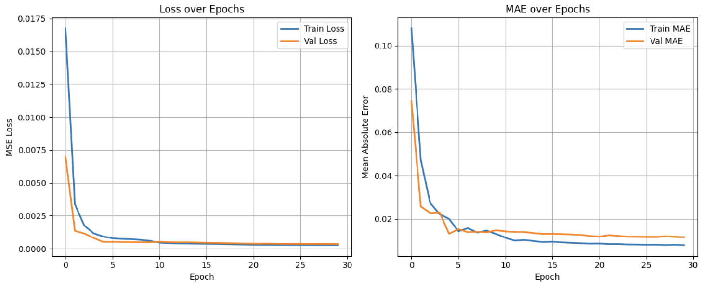

# Deepcache with SyntheticDataset

## 0. Setting

- Used a Kaggle Notebook with a P100 GPU accelerator
- Dataset: `syntheticDataset_O50.csv`

## 1. Load & Split Data

- To align with the paper's goal which is predicting the future characteristics of an object based on past logs, we split the dataset into 60% for training and 40% for evaluation.

## 2. Feature Engineering

> "For dataset 1, the probability of object  $o^i$  is calculated as  $N^i$/1000, where $N^i$ represents the number of $o^i$ occurrences of  in the window of past 1K objects.”
> 
- Using step=1 generated too much data, so we used step=100 to make it manageable.

```python
# Generate training data for sequence-to-sequence modeling from object request logs
def build_sequence_input(df, object_ids, m, k, window_size=1000, step=100):
    X, y = [], []
    for i in range(0, len(df) - window_size * (m + k), step):
        seq = df['object_ID'].iloc[i : i + window_size * (m + k)]
        x_seq, y_seq = [], []

        # Build the input sequence: m windows of past requests
        for j in range(m):
            window = seq[j * window_size : (j + 1) * window_size]
            counts = window.value_counts(normalize=True).reindex(object_ids, fill_value=0).values
            x_seq.append(counts)

        # Build the output sequence: k windows of future requests
        for j in range(k):
            window = seq[(m + j) * window_size : (m + j + 1) * window_size]
            counts = window.value_counts(normalize=True).reindex(object_ids, fill_value=0).values
            y_seq.append(counts)

        X.append(x_seq)
        y.append(y_seq)
```

- Stored the result as `npy` file → `X_dataset1_window.npy`, `y_dataset1_window.npy`
- Result
    ```text
    X_train.shape: (72650, 20, 1)
    y_train.shape: (72650, 10, 1)
    X_test.shape: (43450, 20, 1)
    y_test.shape: (43450, 10, 1)
    ```

## 3. Build LSTM Model

> "For our datasets, we use a two-layer depth LSTM Encoder-Decoder model with 128 and 64 as the number of hidden units. ... The loss function is chosen as mean-squared-error (MSE).”
> 
- Adopt LSTM Encoder-Decoder model for seq2seq prediction
    - Encoder: Encodes the input sequence into a hidden state vector
        
        ```python
         # ----- Encoder -----
        encoder_inputs = Input(shape=(m, 1))  # Input shape: (sequence_length, 1)
        
        # Two-layer encoder with 128 and 64 hidden units
        encoder_lstm_1 = LSTM(128, return_sequences=True)
        encoder_lstm_2 = LSTM(64, return_state=True)
        
        x = encoder_lstm_1(encoder_inputs)
        encoder_outputs, state_h, state_c = encoder_lstm_2(x)
        encoder_states = [state_h, state_c]  # Final encoder states passed to decoder
        ```
        
    - Decoder: Decodes the output sequence from the hidden state vector
        
        ```python
        # ----- Decoder -----
        decoder_inputs = RepeatVector(k)(encoder_outputs)  # Repeat context vector for k time steps
        
        # Two-layer decoder with 128 and 64 hidden units
        decoder_lstm_1 = LSTM(128, return_sequences=True)
        decoder_lstm_2 = LSTM(64, return_sequences=True)
        
        x = decoder_lstm_1(decoder_inputs, initial_state=encoder_states)
        decoder_outputs = decoder_lstm_2(x)
        ```
        

## 4. **Train Model**

> "We ran our experiments for a number of epochs equal to 30, with the batch size set to 10% of the training data.”
> 

```python
batch_size = int(len(X) * 0.1)
model = build_seq2seq_model(m, k)
model.fit(X, y, epochs=30, batch_size=batch_size)

y_pred = model.predict(X)  
```
- Evaluate Model


## 5. **Cache Policy Setting**

> For every object request $o^i_t$ at time $t$, we generate a varying number of “fake object requests” (denoted as $F_t$ ). For dataset 1, we generate $F_t$ by calculating the top M = 5 objects with highest probability at $t + 1$.
> 

```python
M = 5
top_objects_each_t = []
for i in range(len(y_pred)):
    next_probs = y_pred[i, 0].flatten()
    top_indices = next_probs.argsort()[-M:][::-1]
    top_objects_each_t.append(list(top_indices))
```

## 6. Integral Operator

> "The operator is a simple merge operator, where the actual object request is followed by all the fake requests generated by our Caching Policy. This helps us to update the state of the cache by prefetching objects based on future object popularity and evict unpopular ones.”
> 

```python
# Merge real requests and fake requests
merged_requests = []
fake_insert_idx = 0
insert_interval = 5

actual_requests = test_df.sort_values('request_time')['object_ID'].tolist()

for t, req in enumerate(actual_requests):
    merged_requests.append(req)
    if fake_insert_idx < len(top_objects_each_t) and t % insert_interval == 0:
        fake_objs = top_objects_each_t[fake_insert_idx]
        merged_requests.extend(fake_objs)
        fake_insert_idx += 1
```

## 7. **Deep Cache vs Traditional LRU**

> “We compare traditional LRU with Deep Cache, and without Deep Cache." "For dataset 1, we set the cache size to 5.”
> 
- According to our experimental results, the difference between DeepCache and traditional LRU was the largest when the cache size was 6 (within the range of cache sizes from 5 to 10).
    
    
    
    ```
    Max difference at cache size 6:
    DeepCache hit ratio: 0.4561
    Traditional LRU hit ratio: 0.3935
    ```
    

## 8. Limitations

- As the train-test split ratio was not provided, we chose a 60:40 split based on common practice and empirical judgment
- Also there was no mention of the step size used when sliding the window to generate training samples for sequence-to-sequence modeling based on object request logs, so we arbitrarily set it to 100 to keep the training workload manageable in our environment
- Finally, since the merging interval between fake and real requests was not specified, we empirically chose an insert interval of 5