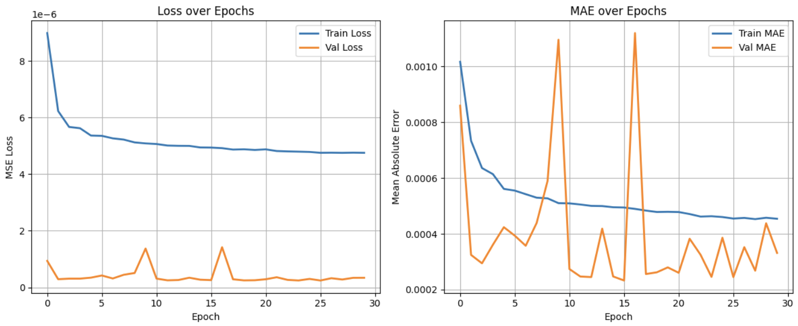

# Deepcache with MediSynDataset

## 0. Setting

- Used a Kaggle Notebook with a P100 GPU accelerator
- Dataset: `mediSynDataset_x2_O3488.csv`

## 1. Load Data & Split Data 
- To align with the paper's goal which is predicting the future characteristics of an object based on past logs, we split the dataset into 60% for training and 40% for evaluation.

- Create Sequences using sliding window

    ``` text
    Train X shape: (717236, 20, 1)
    Train y shape: (717236, 26, 1)
    Test X shape: (245091, 20, 1)
    Test y shape: (245091, 26, 1)
    ```


## 2. Feature Engineering

> "The probability $o^i$  is the normalized frequency of that object in an hour.”
> 
1. Create hourly buckets from request timestamps
2. Count the number of requests for each (hour, object ID) pair
3. Normalize each row to obtain the request probability distribution for all objects at each hour

```python
# Create 'hour' column
train_df['hour'] = train_df['request_time'] // 3600
test_df['hour'] = test_df['request_time'] // 3600

# Unique object list (shared across both sets)
object_ids = df['object_ID'].unique()
object_ids.sort()

# Pivot (hour, object) → count table
train_pivot = train_df.groupby(['hour', 'object_ID']).size().unstack(fill_value=0)
train_pivot = train_pivot.reindex(columns=object_ids, fill_value=0)

test_pivot = test_df.groupby(['hour', 'object_ID']).size().unstack(fill_value=0)
test_pivot = test_pivot.reindex(columns=object_ids, fill_value=0)

# Normalize
train_probs = train_pivot.div(train_pivot.sum(axis=1), axis=0).fillna(0)
test_probs = test_pivot.div(test_pivot.sum(axis=1), axis=0).fillna(0)
```

## 3. Build LSTM Model

> "For our datasets, we use a two-layer depth LSTM Encoder-Decoder model with 128 and 64 as the number of hidden units. ... The loss function is chosen as mean-squared-error (MSE).”
> 
- Adopt LSTM Encoder-Decoder model for seq2seq prediction
    - Encoder: Encodes the input sequence into a hidden state vector
        
        ```python
         # ----- Encoder -----
        encoder_inputs = Input(shape=(m, 1))  # Input shape: (sequence_length, 1)
        
        # Two-layer encoder with 128 and 64 hidden units
        encoder_lstm_1 = LSTM(128, return_sequences=True)
        encoder_lstm_2 = LSTM(64, return_state=True)
        
        x = encoder_lstm_1(encoder_inputs)
        encoder_outputs, state_h, state_c = encoder_lstm_2(x)
        encoder_states = [state_h, state_c]  # Final encoder states passed to decoder
        ```
        
    - Decoder: Decodes the output sequence from the hidden state vector
        
        ```python
        # ----- Decoder -----
        decoder_inputs = RepeatVector(k)(encoder_outputs)  # Repeat context vector for k time steps
        
        # Two-layer decoder with 128 and 64 hidden units
        decoder_lstm_1 = LSTM(128, return_sequences=True)
        decoder_lstm_2 = LSTM(64, return_sequences=True)
        
        x = decoder_lstm_1(decoder_inputs, initial_state=encoder_states)
        decoder_outputs = decoder_lstm_2(x)
        ```
        

## 4. **Train Model**

> "We ran our experiments for a number of epochs equal to 30, with the batch size set to 10% of the training data.”
> 
- Batch size was reduced to 64 due to limited memory capacity
- We stored `y_pred.npy` to our dataset for further use

```python
model = build_seq2seq_model(m, k)
model.fit(X_train, y_train, epochs=30, batch_size=64)

# Predict
y_pred = model.predict(X_test)
```
- Evaluate model


## 5. **Cache Policy Setting**

> "For dataset 2, we rather consider a varying number of top M objects with the highest probability from multiple time intervals. In other words, our fake set of requests $F_t$  not only considers immediate future, but also considers popular objects in the next 12 hours and 24 hours with a diminishing weight for the number of selected objects from each interval.”
> 
- To set different top-M values for different future time intervals, we used top 5 objects from 1 hour ahead, 4 from 12 hours, 3 from 24 hours.

```python
# Set different top-M values for different future time intervals
# Top 5 objects from 1 hour ahead, 4 from 12 hours, 3 from 24 hours
M1, M2, M3 = 5, 4, 3  

top_objects_each_t = []  
for i in range(len(y_pred)):
    top_all = []
    
    # Check three specific future time steps: 0 (1 hour), 11 (12 hours), 23 (24 hours)
    for t, M in zip([0, 11, 23], [M1, M2, M3]):
        if t >= y_pred.shape[1]:
            continue  # Skip if prediction is shorter than the required time step

        next_probs = y_pred[i, t].flatten()  # Predicted probabilities for time step t
        top_indices = next_probs.argsort()[-M:][::-1]  # Get top-M object indices with highest probability
        top_all.extend(top_indices)

    top_objects_each_t.append(top_all)  # Store the deduplicated list of top objects
```

## 6. Integral Operator

> "The operator is a simple merge operator, where the actual object request is followed by all the fake requests generated by our Caching Policy. This helps us to update the state of the cache by prefetching objects based on future object popularity and evict unpopular ones.”
> 

```python
cut_idx = int(len(df) * 0.6)
test_df = df.iloc[cut_idx:].reset_index(drop=True)

# Merge real requests and fake requests
merged_requests = []
fake_insert_idx = 0
insert_interval = 10

actual_requests = test_df.sort_values('request_time')['object_ID'].tolist()

for t, req in enumerate(actual_requests):
    merged_requests.append(req)
    if fake_insert_idx < len(top_objects_each_t) and t % insert_interval == 0:
        fake_objs = top_objects_each_t[fake_insert_idx]
        merged_requests.extend(fake_objs)
        fake_insert_idx += 1
```

## 7. **Deep Cache vs Traditional LRU**

> “We compare traditional LRU with Deep Cache, and without Deep Cache." "For dataset 2, we set the cache size to 150.”
> 

```
DeepCache cache hit ratio: 0.3216
Traditional LRU cache hit ratio: 0.29
```

## 8. Limitations

- As the train-test split ratio was not provided, we chose a 60:40 split based on common practice and empirical judgment
- Even though the paper mentioned about the batch size, due to our lack of memory, we chose to use common batch size as 64
- In caching policy setting, there was no mention of exact diminishing weight, so we arbitrarily chose M as 5, 4, 3
- Finally, since the merging interval between fake and real requests was not specified, we empirically chose an insert interval of 10